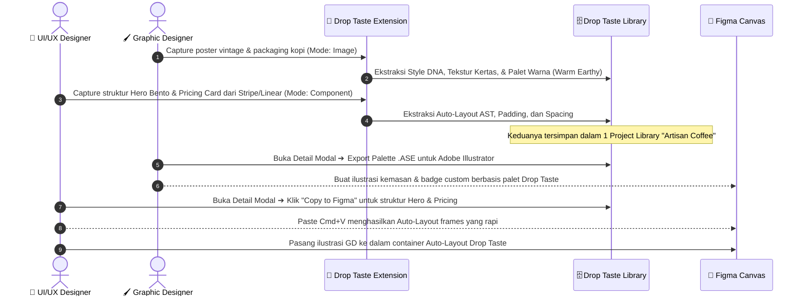
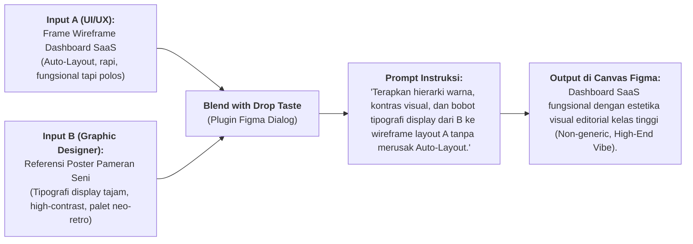

# 🎨⚡ Drop Taste: Unified Creative Workflow
**Sinergi Fungsi Drop Taste untuk UI/UX Designer, Graphic Designer & Illustrator**

---

## 1. Matriks Pemetaan Fungsi Drop Taste Lintas Disiplin

Berikut adalah pemetaan bagaimana setiap fungsi Drop Taste dimanfaatkan secara berbeda namun saling melengkapi oleh **UI/UX Designer** dan **Graphic Designer / Illustrator**:

| Komponen / Fungsi Drop Taste | Pemanfaatan oleh UI/UX Designer | Pemanfaatan oleh Graphic Designer & Illustrator |
| :--- | :--- | :--- |
| **Chrome Extension: `Capture Page`** | Menangkap keseluruhan layout website (skala 1440px desktop / 390px mobile), scroll depth, hierarki informasi, dan susunan responsive section. | Menganalisis komposisi makro *visual storytelling*, ritme editorial poster digital, serta integrasi grafis/ilustrasi di dalam layout. |
| **Chrome Extension: `Capture Component` (Hover Inspector)** | Mengambil container spesifik (navbar, hero bento grid, pricing card, form input) dengan struktur Auto-Layout, padding, dan gap. | Mengambil *asset lockup* tertentu: banner promosi, footer badge, typography header lockup, atau kartu grafis dengan background visual kompleks. |
| **Chrome Extension: `Capture Image Reference`** | Referensi screenshot UI statis yang akan diubah menjadi spesifikasi acuan kode oleh agen coding (`design.md`). | **[HERO FEATURE]** Menangkap karya visual, cover album, poster, packaging, atau 3D render dalam resolusi penuh untuk ekstraksi *Style DNA*. |
| **Ingestion Engine: 5-Step Vision Service** | Menganalisis hierarchy DOM visual, component boundaries, dan layout tree untuk coding agent. | Menganalisis **Style DNA**: Palet warna harmonis (rasio bobot HEX), tekstur (grain/halftone/risograph), pencahayaan (rim light/ambient), dan genre tipografi. |
| **Web Dashboard: Taste Library (Bento Grid)** | Koleksi pola UI (UI Pattern Library): Filter berdasarkan tab `Page` dan `Component`, mencari solusi navigasi atau form patterns. | Moodboard dinamis: Filter berdasarkan tab `Image` dan tag tema (`#cyberpunk`, `#vintage-editorial`, `#claymorphic`, `#palette-warm`). |
| **Capture Detail Modal: Split View & Contextual Actions** | • **"Copy to Figma"**: Langsung paste frame Auto-Layout ke canvas. • Baca `design.md` untuk struktur token dan tata letak. | • **"Export Palette (.ASE / CSS)"**: Ekspor swatch ke Illustrator/Photoshop. • **"Reference with your agent"**: Salin prompt Midjourney `--sref` atau Flux untuk eksplorasi ilustrasi. |
| **Figma Plugin: Library Browser & Inserter** | Menjelajahi library cloud dan 1-klik memasukkan frame Auto-Layout native ke canvas kerja UI. | Menjelajahi referensi grafis dan memasukkan kartu moodboard visual lengkap dengan swatch warna acuan ke canvas branding/poster. |
| **Figma Plugin: "Blend with Drop Taste"** | Memadukan kerangka layout A (misal: SaaS dashboard) dengan struktur bento grid B. | **[CROSS-DISCIPLINE]** Memadukan wireframe layout UI dengan *Art Direction* dari referensi grafis (mewarnai, memberi tipografi display, dan vibe visual). |
| **MCP Server & Connect Hub** | Menghubungkan Claude/Cursor untuk meng-generate komponen React/Tailwind dari spesifikasi. | Menginstruksikan agent kreatif untuk merumuskan konsep copywriting branding, deskripsi gaya packaging, atau prompt visual generator. |

---

## 2. Empat Skenario Kolaboratif Nyata (Synergy Scenarios)

### Skenario 1: Pembuatan Landing Page Kampanye Terintegrasi
*Sebuah studio digital sedang membangun landing page peluncuran produk kopi artisan.*

---

### Skenario 2: Dari Brand Style DNA Menjadi Design Tokens yang Kokoh
*Graphic Designer merumuskan estetika visual brand, UI/UX Designer menerjemahkannya ke sistem token sistematis.*

1. **Eksplorasi Visual (Graphic Designer)**:
   - Berselancar di galeri desain, majalah seni, dan web poster.
   - Menggunakan `Capture Image Reference` untuk menangkap 5 karya seni yang mewakili mood brand (misal: *Swiss Brutalism*).
   - Drop Taste Vision Engine mengekstrak palet dominan, accent contrast, serta rasio distribusi visual:
     - 60% Canvas White (`#F4F4F0`)
     - 30% Ink Black (`#111111`)
     - 10% Acid Lime Accent (`#CCFF00`)
2. **Penerjemahan Token (UI/UX Designer)**:
   - Masuk ke Drop Taste Library di tab `Image`, membuka detail modal acuan tersebut.
   - Meninjau seksi *Extracted Design Tokens* pada `design.md`.
   - Mengimpor variabel tersebut ke dalam Figma Variables (`Primitives` $\rightarrow$ `Semantics` $\rightarrow$ `Components`).
   - Warna dan tipografi display acuan langsung diaplikasikan ke button, modal, dan navigation bar.

---

### Skenario 3: Cross-Discipline "Blend with Drop Taste"
*Memadukan kekuatan struktural UI/UX dengan cita rasa visual Graphic Designer dalam 1 klik di Figma.*

---

### Skenario 4: Unified Studio Taste Library (Bento Moodboard Bersama)
*Menghilangkan sekat folder screenshot lokal antara tim desain grafis dan produk.*

* **Satu Dashboard Bersama**:
  - Tim produk dan tim grafis berbagi ruang kerja Drop Taste yang sama.
  - Terdapat tag multi-fungsi: `#landing-page`, `#3d-illustration`, `#editorial-grid`, `#color-cyberpunk`.
* **Navigasi Carousel Lintas Disiplin**:
  - Saat melakukan *Design Jam* atau sesi eksplorasi, tim membuka **Full-Screen Detail Modal**.
  - Menggunakan panah keyboard `ArrowLeft` dan `ArrowRight` untuk melompat dari screenshot layout aplikasi perbankan langsung ke karya seni abstrak acuan warna di sebelahnya tanpa berpindah-pindah tab browser.

---

## 3. Penyesuaian Antarmuka Drop Taste untuk Mendukung Kedua Peran

Agar Drop Taste dapat melayani kedua profesi ini tanpa terasa membingungkan atau rumit:

### 1. In-Page Hover Inspector (Chrome Extension)
- **Smart Target Detection**:
  - Ketika kursor berada di atas container `
`, `<section>`, atau `<nav>`: Bounding box berwarna **Biru Indigo** dengan label `<tag> W×H px` $\rightarrow$ Klik menyimpan sebagai **Component / Layout**.
  - Ketika kursor berada di atas ``, `<svg>`, `<canvas>`, atau elemen visual kaya warna: Bounding box berubah menjadi **Kuning Amber** dengan badge ikon 🖼️ `Visual Asset / Illustration` $\rightarrow$ Klik menyimpan langsung sebagai **Image Reference**.

### 2. Capture Detail Modal (Web Dashboard)
- **Dua Tab Pratinjau Kiri**:
  - `Visual View`: Pratinjau gambar hires dengan zoom pan dan color eyedropper interaktif.
  - `DNA / Code View`: Menampilkan dokumen kanonikal `design.md` (untuk UI/UX/Engineer) atau *Style DNA & Palette Breakdown* (untuk Graphic Designer).
- **Aksi Cepat di Panel Kanan**:
  - **Jika Tipe Page/Component**:
    - Tombol primer: `Copy to Figma`
    - Tombol sekunder: `View DOM Structure`
  - **Jika Tipe Image**:
    - Tombol primer: `Reference with your agent` (Prompt generator)
    - Tombol sekunder: `Export Swatches (.ASE / HEX)`
    - Tombol tersier: `Send to FigJam Moodboard`

### 3. Figma Plugin
- **Filter Segmentasi Cepat**:
  - Dropdown filter di bagian atas plugin:
    - `All References`
    - `UI Components (Auto-Layout)`
    - `Graphic & Style DNA (Palettes & Assets)`
- **Aksi Drag-and-Drop Terpola**:
  - Men-drag item UI $\rightarrow$ Merender Frame Auto-Layout editable.
  - Men-drag item Grafis $\rightarrow$ Merender Kartu Referensi Visual berukuran proporsional yang dilengkapi 5 chip warna HEX dominan di bawahnya.

---

## 4. Keuntungan Kompetitif Drop Taste

Dengan merangkul UI/UX Designer sekaligus Graphic Designer:
1. **Mengakhiri Friksi "Design System vs Visual Identity"**: Seringkali desainer grafis membuat guideline brand yang sulit diintegrasikan oleh UI/UX designer. Drop Taste menjembatani visual DNA menjadi spesifikasi token yang siap pakai.
2. **Platform All-in-One**: Menghilangkan kebutuhan menggunakan 3 alat terpisah (Pinterest untuk moodboard grafis, Mobbin/HTML-to-Figma untuk UI, dan manual color picker).
3. **Generative & Agent Ready**: Baik pengembang kode frontend maupun kreator visual AI memiliki representasi data terstandarisasi yang siap dipakai oleh agen otonom.
