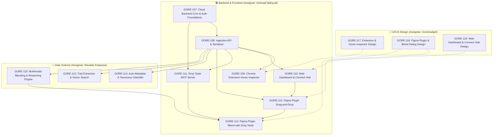

# 🎫 Drop Taste Roadmap & Tracer-Bullet Tickets

Backlog resmi telah dipublikasikan ke issue tracker Multica project **Drop Taste** (`fbff8aca-0c77-4021-aa9e-25387f2fa80a`) di workspace **Goregadget**, terhubung ke GitHub repository [https://github.com/dikamardavid/drop-taste](https://github.com/dikamardavid/drop-taste).

---

## 🗺️ Dependency Graph

---

## 📋 Ticket Summary by Role

### 🎨 UI/UX Design (Assignee: **GoreGadget**)
| Key | Title | Deliverable Utama | Status |
|---|---|---|---|
| **GORE-117** | **Chrome Extension & Interactive Hover Inspector Design System** | Visual specs untuk hover outline, dimension badge, modal capture (`Component` vs `Screen`), direct image toast, dan popup menu. | `backlog` |
| **GORE-118** | **Figma Plugin Interface & 'Blend with Drop Taste' Prompt Dialog** | Layout plugin 360x560px: Login view, library grid cards, dan modal prompt box blending (context frame, model runner pill, reasoning critique accordion). | `backlog` |
| **GORE-119** | **Web Dashboard, Taste Library & Connect Hub Design System** | Responsive desktop design: Library bento gallery, filter sidebar, Detail view + "Copy to Figma" animation, Connect Hub audit table, dan Profile. | `backlog` |

### 🛠️ Backend & Frontend Engineering (Assignee: **Achmad Wahyudi**)
| Key | Disiplin | Title | Status |
|---|---|---|---|
| **GORE-107** | Backend | Cloud Backend Core, Auth & Multi-tenant Database Foundations | `backlog` |
| **GORE-108** | Backend | Capture Ingestion API & Serializer Engine | `backlog` |
| **GORE-109** | Frontend | Chrome Extension Interactive Hover Inspector & Capture Flow | `backlog` |
| **GORE-110** | Frontend | Web Dashboard (Library, Detail Page, Profile, Connect & Agent Token Management) | `backlog` |
| **GORE-111** | Backend | Drop Taste Model Context Protocol (MCP) Server | `backlog` |
| **GORE-112** | Frontend | Figma Plugin (Library Browser & Drag-and-Drop Canvas Reconstruction) | `backlog` |
| **GORE-113** | Frontend | Figma Plugin 'Blend with Drop Taste' Interactive Prompt Box | `backlog` |

### 🧠 Data Science (Assignee: **Revalda Putawara**)
| Key | Title | Deliverable Utama | Status |
|---|---|---|---|
| **GORE-114** | **Automated Metadata & Taxonomy Classification Engine** | Model klasifikasi kategori web (SaaS, E-commerce, dll.), brand extraction, dan auto-suggest tags. | `backlog` |
| **GORE-115** | **Design Trait Extraction & Multimodal Taste Vector Search** | Ekstraksi visual & layout traits (spasial, tipografi, warna) dan vector search untuk `search_taste`. | `backlog` |
| **GORE-116** | **Multi-Modal Design Blending & Reasoning Synthesis Engine** | Pipeline sintesis LLM multimodal yang memadukan beberapa referensi menjadi layout baru + reasoning. | `backlog` |
