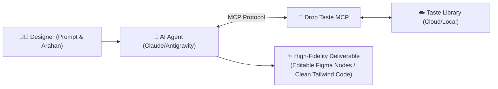

# 🌟 Possibilities: Designer × AI Agent via Drop Taste MCP

Dokumen ini memetakan lanskap potensi dan skenario penggunaan **Drop Taste MCP (Model Context Protocol)** ketika diintegrasikan dengan AI coding/design agents (seperti Claude Desktop, Antigravity, Cursor, atau ChatGPT).

---

## 💡 Paradigma Baru: Dari "AI Generic Slop" ke "Agentic Personal Taste"

Masalah terbesar AI generatif saat ini dalam dunia desain adalah **"AI-Slop"**:
- Tombol rounded-pill generik tanpa alasan
- Gradien ungu/biru murahan
- Spacing acak yang melanggar ritme spasial
- Typographic hierarchy yang kaku dan datar

Dengan **Drop Taste MCP**, AI agent tidak lagi "berhalusinasi" tentang apa itu desain yang bagus. Agent memiliki **akses langsung secara terprogram (real-time query & retrieval) ke selera visual pribadi desainer** yang tersimpan di Taste Library.



---

## 🎯 6 Skenario Kemungkinan Utama (Use Cases)

### 1. Zero-Slop Component Synthesis (Sintesis Komponen Berdasar Referensi)
Desainer ingin membuat komponen baru tanpa harus menjelaskan aturan styling dari nol.

- **Designer Prompt:**
  > *"Buatin landing page hero section untuk web analitik developer. `use_droptaste as reference` dari komponen yang saya capture dari Linear dan Vercel di library saya."*
- **Behind The Scenes (Agent + MCP):**
  1. Agent memanggil `search_taste(query: "developer analytics linear vercel", type: "component")`.
  2. MCP mengembalikan metadata DOM, typographic scale (misal: tracking tight, optical sizing), serta border hairline `rgba(255,255,255,0.08)`.
  3. Agent memformulasikan kode HTML+Tailwind / Figma schema yang **100% meniru standar craft referensi tersebut**, bukan template generik AI.

---

### 2. Multi-Reference Blending ("Blend with Drop Taste")
Mengawinkan DNA estetika dari 2 atau 3 referensi berbeda menjadi satu karya baru yang harmonis.

- **Designer Prompt:**
  > *"Tolong blend pricing card baru: ambil typographic hierarchy dan editorial elegance dari Ref #84 (Stripe Press), surface depth & soft glow dari Ref #42 (Raycast), dan spacing rhythm dari Ref #15 (Apple)."*
- **Behind The Scenes (Agent + MCP):**
  1. Agent memanggil `blend_taste(reference_ids: ["84", "42", "15"], prompt: "Pricing card fusion")`.
  2. MCP & Blending Engine menghitung bobot perpaduan:
     - Typographic scale: Serif editorial display font + clean monospaced subtext.
     - Surface: `backdrop-blur-md` dengan border 1px translucent.
     - Spacing: 8pt grid konsisten.
  3. Agent menghasilkan artefak kode/Figma **lengkap dengan ulasan reasoning kritik** (*mengapa elemen A dipadukan dengan B*).

---

### 3. Automated Personal Design Linter & Code Reviewer
Desainer atau developer ingin mengecek apakah UI yang dibuat junior dev atau AI lain sesuai dengan standar selera desainer.

- **Designer Prompt:**
  > *"Review file `PricingSection.tsx` ini. Cocokkan dengan personal taste profile saya di Drop Taste. Apakah ada anti-pattern yang melanggar standar estetika saya?"*
- **Behind The Scenes (Agent + MCP):**
  1. Agent membaca kode lokal, lalu memanggil `get_taste_profile()`.
  2. MCP mengekstrak aturan anti-pattern (misal: larangan rounded-pill buttons, larangan drop-shadow berlumpur, aturan hairline divider).
  3. Agent memberikan review mendalam:
     > *"⚠️ Temuan 1: Tombol memakai `rounded-full` (Pill), melanggar taste profile Anda yang mengutamakan `rounded-lg (8px)`."*  
     > *"⚠️ Temuan 2: Box shadow terlalu pekat (`shadow-2xl`). Rekomendasi: ganti ke border hairline `border-white/10` dengan `shadow-[0_1px_2px_rgba(0,0,0,0.05)]`."*

---

### 4. Reverse Engineering Inspiration to Design Tokens
Graphic designer atau Brand Designer menangkap 10 poster / visual editorial di web dan ingin mengubahnya menjadi sistem token.

- **Designer Prompt:**
  > *"Ambil 5 referensi terbaru di category 'Editorial Minimal' di Drop Taste saya, ekstrak color DNA dan typographic hierarchy-nya, lalu susun menjadi file `tokens.json` (DTCG format) untuk Figma Variables."*
- **Behind The Scenes (Agent + MCP):**
  1. Agent memanggil `list_taste(category: "Editorial Minimal", limit: 5)`.
  2. Menguraikan palet warna dominan (warm cream `#FDFBF7`, charcoal `#1A1A1A`, accent cinnabar `#E63946`).
  3. Men-generate file `tokens.json` yang siap di-import langsung ke Figma Variables via plugin.

---

### 5. In-Canvas Figma Co-Pilot (Tanpa Biaya AI Vendor Figma)
Desainer sedang bekerja di Figma, membuka dialog *"Blend with Drop Taste"* di plugin Figma.

- **Alur Kerja:**
  1. Desainer memilih satu Frame di canvas (misalnya wireframe kotak-kotak kasar).
  2. Mengetik prompt di modal plugin: *"Poles wireframe form checkout ini menjadi high-fidelity menggunakan inspirasi e-commerce luxury dari Drop Taste library saya."*
  3. Plugin mengirim prompt + snapshot frame ke agent lokal via MCP (`http://localhost:3847`).
  4. Agent meracik referensi dari Drop Taste, lalu mengirim balik perintah node tree ke plugin.
  5. Canvas Figma seketika ter-update dengan auto-layout frames, tipografi yang pas, dan visual assets asli—**semuanya memakai model LLM milik user sendiri (Local/Gemini/Claude API key) tanpa biaya langganan bulanan Figma AI.**

---

### 6. Cross-Discipline Collaboration (UI/UX, Graphic, Illustrator)

| Disiplin Desainer | Cara Menggunakan Drop Taste via Agent |
|---|---|
| **UI/UX Designer** | Mengambil arsitektur layout utuh (*Screen*), hierarki form, dan responsive patterns siap copas ke Figma. |
| **Design System Lead** | Menjaga konsistensi token, mendeteksi drift antara kode engineering dan selera desain (*Taste Parity*). |
| **Graphic Designer** | Mengkurasi komposisi grid poster, typography lockup, dan menginstruksikan agent menata copy text dengan optical balance. |
| **Illustrator / 3D Artist** | Menyimpan referensi lighting, art style, moodboard color palette, dan meminta agent mendeskripsikan prompt visual terstruktur untuk Midjourney/Stable Diffusion. |

---

## 💬 Contoh Percakapan Interaktif Nyata

```text
User: 
"Halo Claude, tolong buatkan modal popup 'Upgrade to Pro' untuk aplikasi SaaS saya. 
use_droptaste untuk referensi card & pricing table terbaik yang pernah saya capture."

Claude (Agent):
"Memeriksa Drop Taste MCP..."
-> Calling drop_taste.search_taste({ query: "pricing modal pro card", tags: ["saas", "dark-mode"] })
-> Ditemukan 2 referensi: #48 (Raycast Pro Card) dan #62 (Linear Upgrade Modal).

Claude (Agent):
"Saya telah mengambil DNA desain dari kedua referensi Anda:
1. Dari Raycast (#48): Saya mengadopsi glassmorphic surface dengan subtle inner stroke 
   dan aksen gradient border 1px.
2. Dari Linear (#62): Saya mengadopsi typographic rhythm dengan badge status monospaced 
   dan hierarki benefit list menggunakan checklist minimalis.

Berikut kodenya yang siap Anda Copy-Paste ke Figma atau langsung dipakai di Next.js:
[Code Preview & Figma Clipboard Data Ready]"
```
